<h1 align="center">Hey, I'm Traian 👋</h1>

  

  

  

  
  
  

## 🚀 About me

I turn complex product and platform problems into clear, dependable experiences. I work across the stack, with a focus on frontend architecture and user experience.

- I build web systems for global scale.
- I work with modern frontend platforms, APIs, and distributed systems.
- I review code and help engineers grow.
- I hold First Class Honours in Computer Science from Dublin City University.

## 🛠️ Toolbox

  
  
  
  
  
  
  
  
  
  
  
  

## ✨ How I work

  
  
  

## 🎯 Current focus

- Product engineering where frontend quality meets reliable backend systems.
- Clear architecture that helps teams move quickly and safely.
- Thoughtful reviews, practical mentoring, and maintainable code.

Build useful things. Make the complex feel simple.

